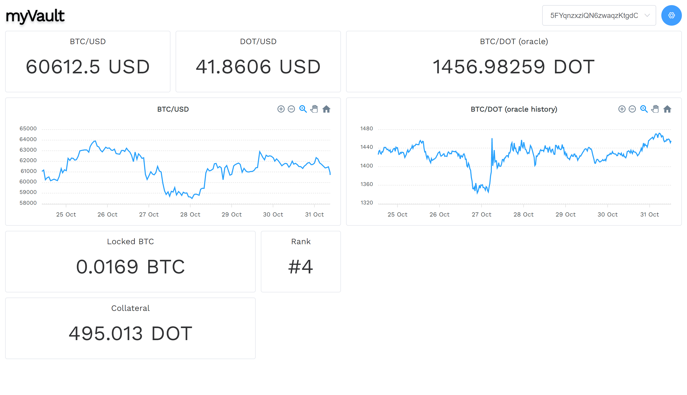

# InterBTC vault operator dashboard

A customizeable dashboard for vault operators.



The dashboard consists of widgets that a user can customize to their liking. The widget's position, size, and content are all customizable. There are two kinds of widgets, General widgets that show price data of the oracle and other public data sources, and there are widgets that display data that corresponds to the configured vault.
For example, the "Rank" widget allows the Vault operators to quickly view the performance of their vault compared to other Vaults in regards to locked BTC.

[Demo](https://vault-dashboard.netlify.app/)

### SubQuery

The second part of the project is the SubQuery project that I've built to make it easier to query information that is normally not available, e.g., the oracle price over time.

GitHub: https://github.com/byteslicer/interbtc-subql

Deployed version: https://explorer.subquery.network/subquery/byteslicer/interbtc

## Project setup

---

```
npm install
```

### Compiles and hot-reloads for development

```
npm run serve
```

### Compiles and minifies for production

```
npm run build
```
